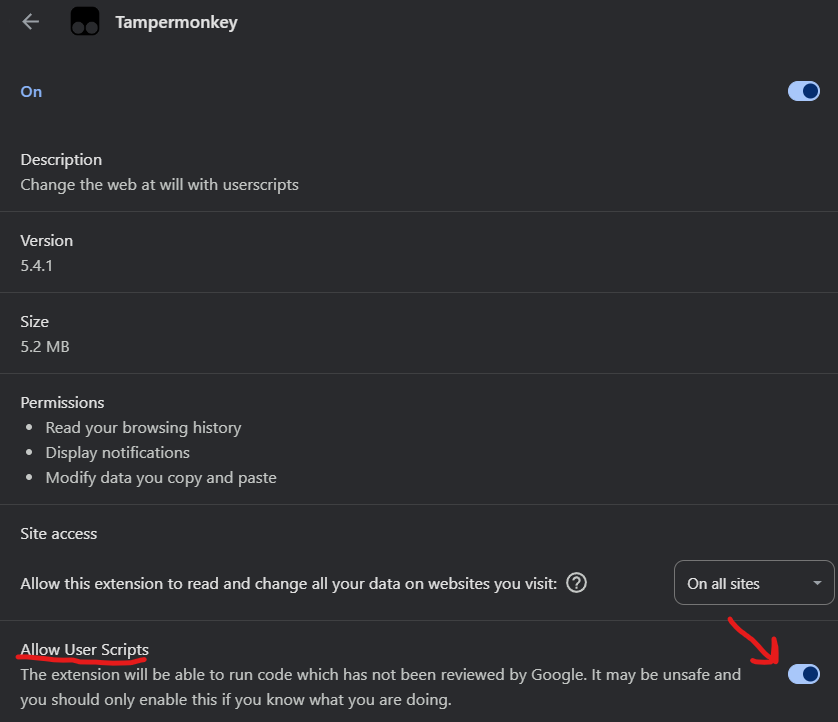
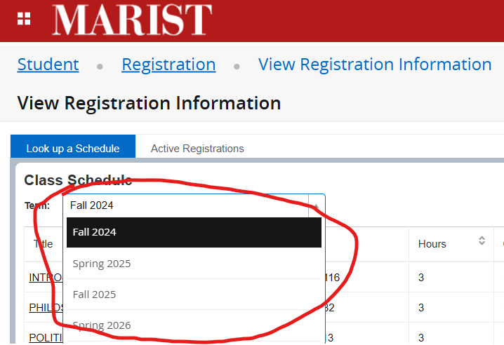
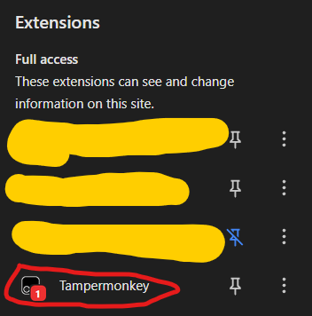
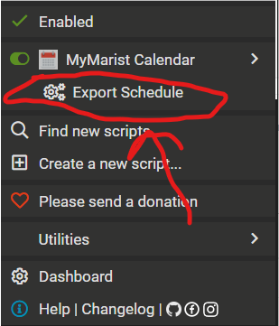

# MyMarist-iCal-Generator
Export your Banner schedule to iCal in one click.
## Installation
1. Install Tampermonkey
2. Enable User Scripts in Chrome Extension Page

    
3. Click Below To Install My Script!
    
    

## How To Use
1. Open your Banner registration / schedule page  
2. Select Term

    

3. Click On **"Tampermonkey"** In The *Extensions* Tab

    

4. Click **"Export Schedule"**

    

5. Download the generated `.ics` file  
6. Import into:
- Apple Calendar 
- *Google Calendar**
- *Outlook**
### \* = not tested

## Common Issues
* The Courses Will Start On The Current Week
    * *This is Just How MyMarist Sends The Course Data*

## Technologies Used
* JavaScript (Tampermonkey userscript)
* Browser XHR interception
* iCalendar (.ics) format